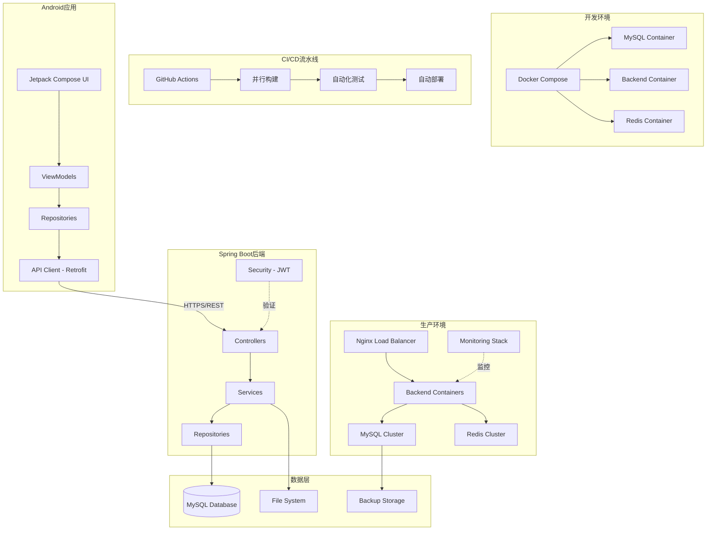

# 设计文档

## 概述

本文档描述了用户认证系统的技术设计，该系统包含Android移动应用（使用Kotlin和Jetpack Compose）和Spring Boot后端服务。系统支持用户注册登录、管理员权限管理、评价模型系统、赛事评价和水果营养查询四个主要功能模块。

设计遵循以下原则：
- 简单直接，避免过度工程化
- 清晰的职责分离（前端、后端、数据层）
- RESTful API设计
- 基于管理员角色的访问控制
- 安全的密码处理和令牌认证

## 项目结构

```
user-auth-system/
├── android-app/                    # Android应用
│   ├── app/
│   │   ├── src/
│   │   │   ├── main/
│   │   │   │   ├── java/com/example/userauth/
│   │   │   │   │   ├── ui/              # Jetpack Compose UI
│   │   │   │   │   ├── viewmodel/       # ViewModels
│   │   │   │   │   ├── data/            # Repositories & API
│   │   │   │   │   └── domain/          # 业务逻辑
│   │   │   │   └── res/                 # 资源文件
│   │   │   ├── test/                    # 单元测试
│   │   │   └── androidTest/             # UI测试（Espresso）
│   │   └── build.gradle
│   └── settings.gradle
│
├── backend/                        # Spring Boot后端
│   ├── src/
│   │   ├── main/
│   │   │   ├── java/com/example/userauth/
│   │   │   │   ├── controller/          # REST Controllers
│   │   │   │   ├── service/             # 业务逻辑
│   │   │   │   ├── repository/          # 数据访问层
│   │   │   │   ├── entity/              # JPA实体
│   │   │   │   ├── dto/                 # 数据传输对象
│   │   │   │   ├── security/            # 安全配置
│   │   │   │   └── config/              # 配置类
│   │   │   └── resources/
│   │   │       ├── application.yml      # 配置文件
│   │   │       └── db/migration/        # 数据库迁移脚本
│   │   └── test/                        # 单元测试、集成测试、属性测试
│   │       ├── java/com/example/userauth/
│   │       │   ├── service/             # Service层测试
│   │       │   ├── controller/          # Controller集成测试
│   │       │   ├── repository/          # Repository测试
│   │       │   └── property/            # 属性测试（jqwik）
│   │       └── resources/
│   │           └── application-test.yml # 测试配置（H2数据库）
│   └── pom.xml (或 build.gradle)
│
├── docs/                           # 文档
│   ├── api/
│   │   └── openapi.yaml            # API文档
│   ├── deployment/
│   │   ├── backend-deploy.md       # 后端部署指南
│   │   └── android-build.md        # Android构建指南
│   └── architecture/
│       └── system-design.md        # 系统架构文档
│
└── scripts/                        # 脚本
    ├── init-db.sql                 # 数据库初始化
    ├── test-data.sql               # 测试数据
    ├── deploy-backend.sh           # 后端部署脚本
    └── backup-db.sh                # 数据库备份脚本
```

**关键说明：**
- **测试位置**：测试代码位于各自项目内部，不使用独立的test文件夹
- **Android测试**：`app/src/test`存放单元测试，`app/src/androidTest`存放UI测试
- **后端测试**：`src/test`存放所有后端测试，使用H2内存数据库
- **文档管理**：`docs/`集中管理所有文档
- **脚本管理**：`scripts/`存放部署和维护脚本

## 架构

### 系统架构图



### 架构层次

**Android应用（前端）**
- **UI层（Jetpack Compose）**: 声明式UI组件，负责渲染界面和处理用户交互
- **ViewModel层**: 管理UI状态，处理业务逻辑，与Repository通信
- **Repository层**: 数据访问抽象层，协调API调用和本地存储
- **API Client层（Retrofit）**: HTTP客户端，负责与后端通信

**Spring Boot后端**
- **Controller层**: 处理HTTP请求，参数验证，调用Service层
- **Service层**: 业务逻辑实现，事务管理
- **Repository层（Spring Data JPA）**: 数据访问层，ORM映射
- **Security层（Spring Security + JWT）**: 认证和授权

**基础设施层**
- **容器化平台（Docker）**: 应用容器化，环境一致性保证
- **编排工具（Docker Compose）**: 多服务编排，本地开发环境管理
- **负载均衡（Nginx）**: 请求分发，SSL终止，静态资源服务
- **缓存层（Redis）**: 会话存储，数据缓存，提升性能
- **监控系统（Prometheus + Grafana）**: 指标收集，性能监控，告警管理

**CI/CD流水线**
- **源码管理（GitHub）**: 版本控制，代码协作
- **自动化构建（GitHub Actions）**: 并行构建Android和后端
- **自动化测试**: 单元测试、集成测试、UI测试
- **自动化部署**: 测试环境和生产环境部署
- **质量门禁**: 代码覆盖率检查，安全扫描

**数据层**
- **MySQL数据库**: 持久化用户、评价、水果数据
- **文件系统**: 存储上传的样本图片
- **备份存储**: 数据库备份，灾难恢复

## 组件和接口

### DevOps和基础设施组件

#### 1. 开发环境组件

**Docker Compose配置**
- 用途：统一本地开发环境
- 服务：MySQL、Redis、后端应用、Nginx
- 配置：
  - MySQL 8.0容器，持久化数据卷
  - Redis 7.0容器，用于会话存储
  - 后端应用容器，支持热重载
  - Nginx容器，反向代理和静态资源服务
- 启动命令：`docker-compose up -d`

**环境变量管理**
- 开发环境：`.env.dev`
- 测试环境：`.env.test`
- 生产环境：`.env.prod`
- 敏感配置通过环境变量注入

#### 2. CI/CD流水线组件

**GitHub Actions工作流**
- 触发条件：推送到main分支，Pull Request
- 并行任务：
  - Android构建和测试
  - 后端构建和测试
  - 安全扫描
  - 代码质量检查
- 部署阶段：
  - 测试环境自动部署
  - 生产环境手动审批部署

**构建配置**
- Android：Gradle构建，生成APK和AAB
- 后端：Maven构建，生成Docker镜像
- 镜像仓库：GitHub Container Registry
- 版本标签：基于Git提交哈希

#### 3. 监控和日志组件

**健康检查端点**
- `/actuator/health`：应用健康状态
- `/actuator/metrics`：应用指标
- `/actuator/info`：应用信息
- 自定义健康检查：数据库连接、Redis连接

**日志管理**
- 结构化日志：JSON格式
- 日志级别：ERROR、WARN、INFO、DEBUG
- 日志轮转：按大小和时间轮转
- 集中化日志：ELK Stack（可选）

**监控指标**
- 应用指标：响应时间、吞吐量、错误率
- 系统指标：CPU、内存、磁盘、网络
- 业务指标：用户注册数、评价提交数
- 告警规则：基于阈值的自动告警

#### 4. 安全配置组件

**SSL/TLS配置**
- 证书管理：Let's Encrypt自动续期
- TLS版本：TLS 1.3
- 加密套件：现代化加密算法
- HSTS：强制HTTPS

**密钥管理**
- JWT密钥：环境变量注入
- 数据库密码：Docker Secrets
- API密钥：加密存储
- 密钥轮转：定期更新机制

### Android应用组件

#### 1. 认证模块

**RegisterScreen**
- 用途：用户注册界面
- 输入：用户名、密码
- 输出：注册成功/失败消息
- 依赖：AuthViewModel

**LoginScreen**
- 用途：用户登录界面
- 输入：用户名、密码
- 输出：登录成功后导航到主界面
- 依赖：AuthViewModel

**AuthViewModel**
- 用途：管理认证状态和逻辑
- 方法：
  - `register(username: String, password: String): Result<User>`
  - `login(username: String, password: String): Result<AuthToken>`
  - `logout()`
- 依赖：AuthRepository

**AuthRepository**
- 用途：认证数据访问
- 方法：
  - `register(username: String, password: String): ApiResponse<User>`
  - `login(username: String, password: String): ApiResponse<AuthToken>`
  - `saveToken(token: String)`
  - `getToken(): String?`
- 依赖：AuthApiService, SharedPreferences

#### 2. 主导航模块

**MainScreen**
- 用途：登录后的主导航界面
- 显示：用户名、功能按钮（赛事评价、水果营养查询）
- 依赖：UserViewModel

#### 3. 赛事评价模块

**AdminScreen**（仅管理员）
- 用途：管理员功能入口界面
- 功能：访问评价模型管理、赛事管理
- 依赖：UserViewModel（验证管理员权限）

**ModelManagementScreen**（仅管理员）
- 用途：评价模型管理界面
- 功能：创建、编辑、删除评价模型
- 依赖：ModelViewModel

**CompetitionCreateScreen**（仅管理员）
- 用途：赛事创建界面
- 功能：创建赛事、选择评价模型、添加评委
- 依赖：CompetitionViewModel

**CompetitionManagementScreen**（仅管理员）
- 用途：赛事管理界面
- 功能：查看赛事列表、管理赛事
- 依赖：CompetitionViewModel

**RatingScreen**（评委）
- 用途：评分界面
- 功能：查看参赛作品、基于评价模型的参数进行评分、提交评分
- 依赖：RatingViewModel

**DataDisplayScreen**
- 用途：评分数据展示界面
- 功能：查看各参数平均分、总平均分、统计数据
- 依赖：DataViewModel

#### 4. 水果营养查询模块

**FruitNutritionScreen**
- 用途：水果营养查询界面
- 输入：查询类型（营养成分/风味）、水果名称
- 输出：查询结果表格
- 依赖：FruitViewModel

### 后端API接口

#### 认证API

**POST /api/auth/register**
- 请求体：`{ "username": "string", "password": "string" }`
- 响应：`{ "id": "long", "username": "string", "roles": ["string"] }`
- 状态码：201 Created / 400 Bad Request

**POST /api/auth/login**
- 请求体：`{ "username": "string", "password": "string" }`
- 响应：`{ "token": "string", "username": "string", "roles": ["string"] }`
- 状态码：200 OK / 401 Unauthorized

#### 评价模型API

**GET /api/evaluation-models**
- 权限：所有用户
- 响应：`[{ "id": "long", "name": "string", "parameters": [{ "id": "long", "name": "string", "weight": "int", "displayOrder": "int" }] }]`
- 状态码：200 OK

**POST /api/evaluation-models**
- 权限：管理员
- 请求体：`{ "name": "string", "parameters": [{ "name": "string", "weight": "int" }] }`
- 响应：`{ "id": "long", "name": "string" }`
- 状态码：201 Created / 403 Forbidden / 400 Bad Request（总分值不为100）

**GET /api/evaluation-models/{id}**
- 权限：所有用户
- 响应：`{ "id": "long", "name": "string", "parameters": [...] }`
- 状态码：200 OK / 404 Not Found

**PUT /api/evaluation-models/{id}**
- 权限：管理员
- 请求体：模型数据
- 状态码：200 OK / 403 Forbidden / 404 Not Found / 400 Bad Request（总分值不为100）

**DELETE /api/evaluation-models/{id}**
- 权限：管理员
- 状态码：204 No Content / 403 Forbidden / 409 Conflict（模型被使用）

#### 赛事API

**GET /api/competitions**
- 权限：管理员查看所有赛事，评委查看自己参与的赛事
- 响应：赛事列表
- 状态码：200 OK

**POST /api/competitions**
- 权限：管理员
- 请求体：`{ "name": "string", "modelId": "long", "deadline": "datetime", "judgeIds": ["long"] }`
- 响应：`{ "id": "long", "name": "string" }`
- 状态码：201 Created / 403 Forbidden / 400 Bad Request（模型不存在）

**GET /api/competitions/{id}**
- 权限：根据赛事参与者
- 响应：赛事详情（包含评价模型信息）
- 状态码：200 OK / 403 Forbidden / 404 Not Found

**POST /api/competitions/{id}/entries**
- 权限：管理员
- 请求体：multipart/form-data（参赛作品信息和图片）
- 响应：`{ "entryIds": ["long"] }`
- 状态码：201 Created / 403 Forbidden

#### 评分API

**POST /api/ratings**
- 权限：评委
- 请求体：`{ "competitionId": "long", "entryId": "long", "scores": [{ "parameterId": "long", "score": "double" }], "note": "string" }`
- 状态码：201 Created / 403 Forbidden / 400 Bad Request（截止时间已过或评分超出范围）

**GET /api/ratings/{competitionId}**
- 权限：赛事结束后所有用户
- 响应：所有评分数据（包含各参数平均分和总平均分）
- 状态码：200 OK / 403 Forbidden

**GET /api/competitions/{id}/export**
- 权限：管理员
- 响应：CSV文件
- 状态码：200 OK / 403 Forbidden

#### 水果营养API

**GET /api/fruit/query**
- 参数：`type=nutrition|flavor&fruit=mango|banana`
- 响应：`{ "fruit": "string", "type": "string", "data": [...] }`
- 状态码：200 OK / 400 Bad Request / 404 Not Found

#### 文件访问API

**GET /api/files/{filename}**
- 响应：图片文件
- 状态码：200 OK / 404 Not Found

## 数据模型

### 数据库表结构

#### 用户表（users）
```sql
CREATE TABLE users (
    id BIGINT PRIMARY KEY AUTO_INCREMENT,
    username VARCHAR(20) UNIQUE NOT NULL,
    password_hash VARCHAR(255) NOT NULL,
    is_admin BOOLEAN DEFAULT FALSE,
    created_at TIMESTAMP DEFAULT CURRENT_TIMESTAMP
);
```

#### 评价模型表（evaluation_models）
```sql
CREATE TABLE evaluation_models (
    id BIGINT PRIMARY KEY AUTO_INCREMENT,
    name VARCHAR(100) NOT NULL,
    created_at TIMESTAMP DEFAULT CURRENT_TIMESTAMP
);
```

#### 评价参数表（evaluation_parameters）
```sql
CREATE TABLE evaluation_parameters (
    id BIGINT PRIMARY KEY AUTO_INCREMENT,
    model_id BIGINT NOT NULL,
    name VARCHAR(100) NOT NULL,
    weight INT NOT NULL,  -- 参数权重分值
    display_order INT NOT NULL,
    FOREIGN KEY (model_id) REFERENCES evaluation_models(id) ON DELETE CASCADE
);
```

#### 赛事表（competitions）
```sql
CREATE TABLE competitions (
    id BIGINT PRIMARY KEY AUTO_INCREMENT,
    name VARCHAR(100) NOT NULL,
    model_id BIGINT NOT NULL,
    creator_id BIGINT NOT NULL,
    deadline TIMESTAMP NOT NULL,
    status VARCHAR(20) NOT NULL,  -- 'ACTIVE', 'ENDED'
    created_at TIMESTAMP DEFAULT CURRENT_TIMESTAMP,
    FOREIGN KEY (model_id) REFERENCES evaluation_models(id),
    FOREIGN KEY (creator_id) REFERENCES users(id)
);
```

#### 赛事评委表（competition_judges）
```sql
CREATE TABLE competition_judges (
    id BIGINT PRIMARY KEY AUTO_INCREMENT,
    competition_id BIGINT NOT NULL,
    judge_id BIGINT NOT NULL,
    FOREIGN KEY (competition_id) REFERENCES competitions(id) ON DELETE CASCADE,
    FOREIGN KEY (judge_id) REFERENCES users(id),
    UNIQUE KEY (competition_id, judge_id)
);
```

#### 参赛作品表（competition_entries）
```sql
CREATE TABLE competition_entries (
    id BIGINT PRIMARY KEY AUTO_INCREMENT,
    competition_id BIGINT NOT NULL,
    entry_name VARCHAR(100),
    file_path VARCHAR(255),
    display_order INT NOT NULL,
    created_at TIMESTAMP DEFAULT CURRENT_TIMESTAMP,
    FOREIGN KEY (competition_id) REFERENCES competitions(id) ON DELETE CASCADE
);
```

#### 评分表（competition_ratings）
```sql
CREATE TABLE competition_ratings (
    id BIGINT PRIMARY KEY AUTO_INCREMENT,
    competition_id BIGINT NOT NULL,
    entry_id BIGINT NOT NULL,
    judge_id BIGINT NOT NULL,
    parameter_id BIGINT NOT NULL,
    score DOUBLE NOT NULL,
    submitted_at TIMESTAMP DEFAULT CURRENT_TIMESTAMP,
    note TEXT,
    FOREIGN KEY (competition_id) REFERENCES competitions(id),
    FOREIGN KEY (entry_id) REFERENCES competition_entries(id),
    FOREIGN KEY (judge_id) REFERENCES users(id),
    FOREIGN KEY (parameter_id) REFERENCES evaluation_parameters(id),
    UNIQUE KEY (entry_id, judge_id, parameter_id)
);
```

#### 水果表（fruits）
```sql
CREATE TABLE fruits (
    id BIGINT PRIMARY KEY AUTO_INCREMENT,
    name VARCHAR(50) UNIQUE NOT NULL
);
```

#### 营养成分表（nutrition_data）
```sql
CREATE TABLE nutrition_data (
    id BIGINT PRIMARY KEY AUTO_INCREMENT,
    fruit_id BIGINT NOT NULL,
    component_name VARCHAR(100) NOT NULL,
    value DECIMAL(10, 2) NOT NULL,
    FOREIGN KEY (fruit_id) REFERENCES fruits(id)
);
```

#### 风味特征表（flavor_data）
```sql
CREATE TABLE flavor_data (
    id BIGINT PRIMARY KEY AUTO_INCREMENT,
    fruit_id BIGINT NOT NULL,
    component_name VARCHAR(100) NOT NULL,
    value DECIMAL(10, 2) NOT NULL,
    FOREIGN KEY (fruit_id) REFERENCES fruits(id)
);
```

**说明：**
- 营养成分和风味数据使用相同的表结构：成分名称 + 数值
- 数值使用DECIMAL(10, 2)类型，支持最多10位数字，其中2位小数
- 查询结果以两列表格形式展示：第一列为成分名称，第二列为数值

### 数据传输对象（DTO）

#### RegisterRequest
```kotlin
data class RegisterRequest(
    val username: String,
    val password: String
)
```

#### LoginRequest
```kotlin
data class LoginRequest(
    val username: String,
    val password: String
)
```

#### AuthResponse
```kotlin
data class AuthResponse(
    val token: String,
    val username: String,
    val roles: List<String>
)
```

#### EvaluationModelRequest
```kotlin
data class EvaluationModelRequest(
    val name: String,
    val parameters: List<ParameterRequest>
)

data class ParameterRequest(
    val name: String,
    val weight: Int
)
```

#### CompetitionRequest
```kotlin
data class CompetitionRequest(
    val name: String,
    val modelId: Long,
    val deadline: LocalDateTime,
    val judgeIds: List<Long>
)
```

#### RatingRequest
```kotlin
data class RatingRequest(
    val competitionId: Long,
    val entryId: Long,
    val scores: List<ScoreRequest>,
    val note: String?
)

data class ScoreRequest(
    val parameterId: Long,
    val score: Double
)
```

#### FruitQueryResponse
```kotlin
data class FruitQueryResponse(
    val fruit: String,
    val type: String,  // "nutrition" or "flavor"
    val data: List<QueryDataItem>
)

data class QueryDataItem(
    val componentName: String,
    val value: Double
)
```

**说明：**
- 查询响应包含水果名称、查询类型和数据列表
- 每个数据项包含成分名称和数值
- 前端将数据渲染为两列表格：成分名称 | 数值

## 错误处理

### 错误响应格式

所有API错误响应使用统一格式：
```json
{
  "timestamp": "2024-01-01T12:00:00",
  "status": 400,
  "error": "Bad Request",
  "message": "用户名已存在",
  "path": "/api/auth/register"
}
```

### 错误类型

**客户端错误（4xx）**
- 400 Bad Request：请求参数无效
- 401 Unauthorized：未认证或令牌无效
- 403 Forbidden：无权限访问资源
- 404 Not Found：资源不存在
- 409 Conflict：资源冲突（如用户名已存在）

**服务器错误（5xx）**
- 500 Internal Server Error：服务器内部错误
- 503 Service Unavailable：服务暂时不可用

### Android错误处理策略

- 网络错误：显示"网络连接失败，请检查网络设置"
- 认证错误：清除本地令牌，导航到登录界面
- 权限错误：显示"您没有权限执行此操作"
- 验证错误：在表单字段下显示具体错误信息
- 服务器错误：显示"服务器错误，请稍后重试"

## 测试策略

### 测试环境架构

**容器化测试环境**
- 所有测试使用Docker容器，确保环境一致性
- 后端测试：MySQL 8.0容器 + Redis容器（解决H2与MySQL方言差异问题）
- 前端测试：Android模拟器容器，支持CI/CD自动化
- 测试数据：每次测试前自动重置，支持并行测试

**测试数据库配置**
```yaml
# application-test.yml
spring:
  datasource:
    url: jdbc:mysql://mysql-test:3306/userauth_test
    username: test_user
    password: test_password
  jpa:
    hibernate:
      ddl-auto: create-drop
  redis:
    host: redis-test
    port: 6379
  flyway:
    enabled: true
    locations: classpath:db/migration
```

**测试环境一致性保证**
- 使用与生产环境相同的MySQL版本和配置
- 数据库迁移脚本在测试和生产环境中行为一致
- SQL方言、约束、外键行为完全一致
- 消除"测试通过但生产失败"的环境差异问题

### 后端测试（完全自动化）

**单元测试（JUnit + Mockito）**
- Service层业务逻辑测试
  - 用户注册逻辑（用户名验证、密码验证、重复检查）
  - 用户登录逻辑（凭证验证、令牌生成）
  - 密码哈希和验证测试
  - JWT令牌生成和验证测试
  - 权限验证逻辑测试
  - 评价模型管理逻辑
  - 评价任务管理逻辑
  - 文件上传验证逻辑
  - 水果查询逻辑
- Repository层数据访问测试
  - 用户数据持久化测试
  - 评价数据持久化测试
  - 水果数据查询测试

**集成测试（TestContainers + MySQL）**
- 使用真实MySQL容器，确保与生产环境一致性
- API端点测试（使用MockMvc，不需要启动真实服务器）
  - 认证API测试（注册、登录）
  - 评价模型API测试（CRUD操作）
  - 评价任务API测试（创建、查询、提交）
  - 水果查询API测试
  - 文件上传和访问API测试
- 数据库集成测试
  - 使用MySQL容器，测试真实SQL方言和约束
  - 测试事务管理和隔离级别
  - 测试外键约束和唯一性约束
  - 测试数据库连接池和超时处理
  - **验证Flyway迁移脚本在MySQL中的行为**
- 权限控制集成测试
  - 测试不同角色的访问权限
  - 测试JWT令牌验证
- **端到端业务流程测试**
  - 完整的用户注册→登录→权限验证流程
  - 完整的评价模型创建→赛事创建→评分→数据导出流程
  - 跨模块的数据一致性验证

**属性测试（Property-Based Testing）**
- 使用jqwik框架进行属性测试
- 测试所有设计文档中定义的正确性属性
- 自动生成大量测试用例验证属性

### Android测试（完全自动化）

**单元测试（JUnit + MockK）**
- ViewModel测试：状态管理和业务逻辑
- Repository测试：数据访问和缓存逻辑
- 工具类测试：数据验证、格式化等
- 执行命令：`./gradlew test`
- 目标覆盖率：70%+

**集成测试（MockWebServer）**
- API客户端测试：HTTP请求构建和响应解析
- 网络错误处理：超时、连接失败等场景
- 数据序列化测试：JSON解析和生成
- 执行命令：`./gradlew testDebugUnitTest`

**UI测试（Espresso + 容器化自动化）**
- 界面交互测试：点击、输入、导航
- 用户流程测试：注册、登录、评价完整流程
- 错误处理测试：网络错误、验证错误显示
- 执行命令：`./gradlew connectedAndroidTest`
- **CI/CD集成**：支持在GitHub Actions中自动执行
- **无头模式**：使用Android模拟器容器，无需物理设备
- **并发执行**：支持多个测试用例并行运行
- **测试报告**：自动生成HTML测试报告和覆盖率报告

**测试自动化改进**
- 所有UI测试可在CI环境中自动执行
- 测试执行时间优化到15分钟以内
- 测试失败自动截图和日志收集
- 支持不同Android版本的兼容性测试

**单元测试（JUnit + MockK）**
- ViewModel逻辑测试
  - 输入验证逻辑
  - 状态管理逻辑
  - 数据转换逻辑
- Repository层测试
  - API调用逻辑（使用Mock）
  - 本地存储逻辑
  - 数据映射逻辑

**集成测试（使用MockWebServer）**
- API集成测试
  - 模拟后端响应
  - 测试网络错误处理
  - 测试数据解析

### Android UI测试（需要Android Studio手动执行）

**注意：以下UI测试需要在Android Studio中手动运行，使用Espresso框架**

**UI交互测试（Espresso）**
- 注册界面测试
  - 测试输入字段交互
  - 测试错误消息显示
  - 测试加载指示器
- 登录界面测试
  - 测试登录成功流程
  - 测试错误处理
- 主导航界面测试
  - 测试按钮点击和导航
  - 测试用户信息显示
- 评价系统界面测试
  - 测试管理员界面
  - 测试模型管理界面
  - 测试赛事管理界面
  - 测试评分界面
  - 测试数据展示界面
- 水果查询界面测试
  - 测试下拉选择框
  - 测试查询结果显示

**UI测试执行指南**
1. 在Android Studio中打开项目
2. 连接Android设备或启动模拟器
3. 右键点击测试类，选择"Run"
4. 观察UI自动化测试执行过程
5. 查看测试报告

### 端到端测试

**后端端到端测试（可自动化）**
- 完整的用户注册登录流程
- 完整的评价模型创建流程
- 完整的赛事创建和评分流程
- 完整的水果营养查询流程
- 权限控制验证

**前后端集成测试（需要手动执行）**
- 启动后端服务
- 在Android设备上运行应用
- 手动测试完整用户流程

### 性能测试（可选）

**注意：以下性能测试为可选任务，不影响核心功能验证**

- 高并发测试（使用JMeter或Gatling）
  - 测试多用户同时注册登录
  - 测试多用户同时提交评价
- 负载测试
  - 测试系统在高负载下的响应时间
  - 测试数据库连接池性能
- 压力测试
  - 测试系统的最大承载能力
  - 测试系统的故障恢复能力

### 测试数据

**预置测试数据**
- 测试用户：管理员用户（isAdmin=true）、普通用户（isAdmin=false）、评委用户
- 测试评价模型：预设"芒果"模型（外观10分、风味24分、滋味16分、质构18分、形状22分、营养10分）
- 测试赛事：进行中和已结束的赛事
- 水果数据：芒果和香蕉的营养和风味数据

### 测试执行顺序

1. **后端单元测试** - 独立测试各个组件
2. **后端集成测试** - 测试API端点和数据库
3. **后端属性测试** - 验证正确性属性
4. **Android单元测试** - 测试ViewModel和Repository
5. **Android集成测试** - 测试API调用
6. **Android UI测试** - 在Android Studio中手动执行
7. **端到端测试** - 测试完整流程
8. **性能测试（可选）** - 根据需要执行


## 正确性属性

属性是一个特征或行为，应该在系统的所有有效执行中保持为真——本质上是关于系统应该做什么的形式化陈述。属性作为人类可读规范和机器可验证的正确性保证之间的桥梁。

### 用户注册属性

**属性 1: 有效注册创建用户**
*对于任何*有效的用户名（3-20个字符，仅包含字母数字和下划线）和有效的密码（至少8个字符），注册应该成功并在数据库中创建用户记录。
**验证需求：1.1, 1.3, 1.7**

**属性 2: 重复用户名被拒绝**
*对于任何*已存在的用户名，尝试使用相同用户名注册应该失败并返回错误。
**验证需求：1.2**

**属性 3: 无效密码被拒绝**
*对于任何*少于8个字符的密码，注册应该失败并返回验证错误。
**验证需求：1.4**

**属性 4: 密码安全存储**
*对于任何*注册的用户，数据库中存储的密码应该是哈希值，而不是明文。
**验证需求：1.5, 11.1**

**属性 5: 注册响应包含用户信息**
*对于任何*成功的注册，响应应该包含用户ID、用户名和角色信息。
**验证需求：1.6**

### 用户登录属性

**属性 6: 有效凭证返回令牌**
*对于任何*已注册的用户，使用正确的用户名和密码登录应该返回有效的认证令牌。
**验证需求：2.1**

**属性 7: 错误密码被拒绝**
*对于任何*已存在的用户，使用错误的密码登录应该失败并返回认证错误。
**验证需求：2.2**

**属性 8: 不存在的用户名被拒绝**
*对于任何*不存在的用户名，登录应该失败并返回认证错误。
**验证需求：2.3**

**属性 9: 令牌有效性**
*对于任何*成功登录获得的令牌，使用该令牌访问受保护的API应该成功。
**验证需求：2.4**

**属性 10: 令牌包含过期时间**
*对于任何*生成的认证令牌，解析后应该包含过期时间字段。
**验证需求：11.5**

### 权限管理属性

**属性 11: 管理员权限**
*对于任何*拥有管理员权限（is_admin=true）的用户，应该能够访问评价模型管理、赛事管理功能。
**验证需求：6.2**

**属性 12: 非管理员权限限制**
*对于任何*非管理员用户，尝试访问评价模型管理或赛事创建功能应该被拒绝并返回403 Forbidden错误。
**验证需求：6.3**

**属性 13: 评委评分权限**
*对于任何*被指定为赛事评委的用户，应该能够为该赛事的参赛作品评分。
**验证需求：6.4**

**属性 14: 权限验证**
*对于任何*用户尝试访问超出其权限的功能时，后端应该返回403 Forbidden错误。
**验证需求：6.5**

### 评价模型管理属性

**属性 15: 非管理员无法访问模型管理**
*对于任何*不是管理员的用户，尝试创建、编辑或删除评价模型应该被拒绝。
**验证需求：6.2.2**

**属性 16: 模型创建持久化**
*对于任何*有效的评价模型，创建成功后应该能从数据库中查询到该模型及其所有参数。
**验证需求：6.2.10**

**属性 17: 被使用的模型不能删除**
*对于任何*被赛事使用的模型，尝试删除应该失败并返回冲突错误。
**验证需求：6.2.13, 9.1.8**

**属性 18: 评价模型总分值验证**
*对于任何*评价模型，所有参数的权重之和必须等于100分，否则创建或更新应该失败。
**验证需求：6.2.5**

**属性 19: 预设芒果模型**
*系统应该*预置"芒果"评价模型，包含外观10分、风味24分、滋味16分、质构18分、形状22分、营养10分。
**验证需求：6.2.14**

### 赛事管理属性

**属性 20: 赛事必须关联评价模型**
*对于任何*赛事创建请求，必须指定一个有效的评价模型ID，否则创建应该失败。
**验证需求：6.3.3**

**属性 21: 已结束赛事拒绝评分提交**
*对于任何*状态为"已结束"的赛事，尝试提交新的评分应该失败。
**验证需求：6.3.13**

**属性 22: 截止时间后拒绝提交**
*对于任何*截止时间已过的赛事，尝试提交评分应该失败。
**验证需求：6.4.19**

### 评分属性

**属性 23: 评分基于评价模型参数**
*对于任何*评分提交，必须为评价模型的每个参数提供评分，否则提交应该失败。
**验证需求：6.4.5**

**属性 24: 评分范围验证**
*对于任何*参数评分，分值必须在0到该参数权重之间，否则提交应该失败。
**验证需求：6.4.6**

**属性 25: 评分可修改**
*对于任何*在截止时间前已提交的评分，应该能够修改并重新提交。
**验证需求：6.4.20**

**属性 26: 评分数据完整性**
*对于任何*评分提交，数据库应该正确存储每个参数的评分值。
**验证需求：6.4.7**

### 数据展示属性

**属性 27: 各参数平均分计算**
*对于任何*参赛作品，系统应该正确计算每个评价参数的平均分。
**验证需求：6.5.3**

**属性 28: 总平均分计算**
*对于任何*参赛作品，系统应该正确计算所有参数的总平均分。
**验证需求：6.5.4**

**属性 29: 评分数据导出完整性**
*对于任何*已结束的赛事，导出的CSV文件应该包含所有评委对所有参赛作品的所有参数的评分数据。
**验证需求：6.5.11**

### 水果营养查询属性

**属性 22: 未完成选择显示提示**
*对于任何*未选择查询类型或水果的查询请求，应该显示友好的提示信息。
**验证需求：7.8**

**属性 23: 有效查询返回数据**
*对于任何*有效的查询类型和水果组合，应该从数据库检索并返回相应的数据。
**验证需求：7.9, 10.6**

**属性 24: 不存在的水果返回404**
*对于任何*不存在的水果名称，查询应该返回404 Not Found错误。
**验证需求：10.7**

### 文件上传属性

**属性 25: 文件格式验证**
*对于任何*上传的文件，只有JPG、PNG、WEBP格式应该被接受，其他格式应该被拒绝。
**验证需求：10.1.2**

**属性 26: 文件大小验证**
*对于任何*上传的文件，超过10MB的文件应该被拒绝。
**验证需求：10.1.3**

**属性 27: 文件存储持久化**
*对于任何*成功上传的文件，应该能在服务器文件系统中找到该文件。
**验证需求：10.1.4**

**属性 28: 文件名唯一性**
*对于任何*上传的多个文件，生成的文件名应该都是唯一的。
**验证需求：10.1.5**

### 数据持久化属性

**属性 29: 用户数据持久化**
*对于任何*注册的用户，数据库应该持久化用户名、密码哈希和角色信息。
**验证需求：9.2**

**属性 30: 用户名唯一性约束**
*对于任何*尝试插入重复用户名的操作，数据库应该拒绝并返回唯一性约束违反错误。
**验证需求：9.3**

### 密码验证属性

**属性 31: 密码哈希比较**
*对于任何*登录尝试，系统应该比较密码的哈希值而不是明文，正确的密码应该验证成功，错误的密码应该验证失败。
**验证需求：11.3**
